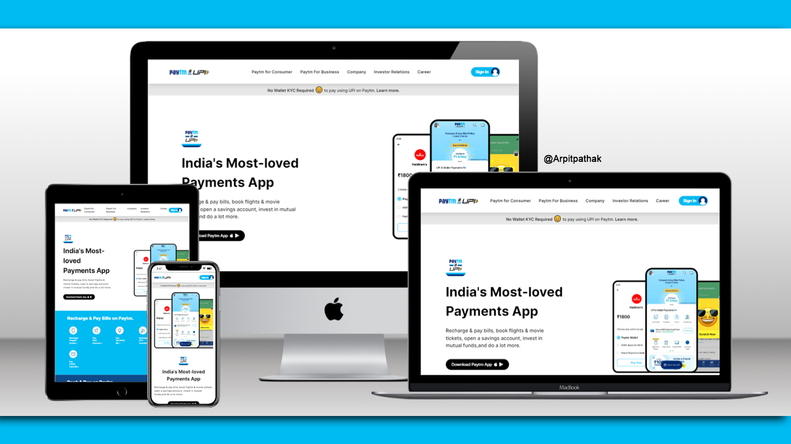

# PAYTM Website

## Paytm clone 🚀 Website's [Live Link](https://arpit-mytm.netlify.app/)🔗

>by Arpit Pathak ✨

Screenshot

## 📌 What I learned from this Project? 📝 
- The project is made entirely with html and tailwind css, so I have learned about tailwind in-depth.
- I learned how to make beautiful cards with hover effect 
- Learned about `transform` property `scale` to make zoom effect on hover on cards.
- Learned to change svg colors on hover over button.
- Learned about `transalte` property to change the position of arrow inside button on hover.
- Learned to use position `Relative` & `Absolute` with `z-index` in combination so that items can be stacked on top of each other.
- Learned about `Flexbox` and its properties `justify-content`, `align-items`, `gap` & `flex-direction`.

## 📌 Time taken to finish this project ⏳
- 15 hours

---

